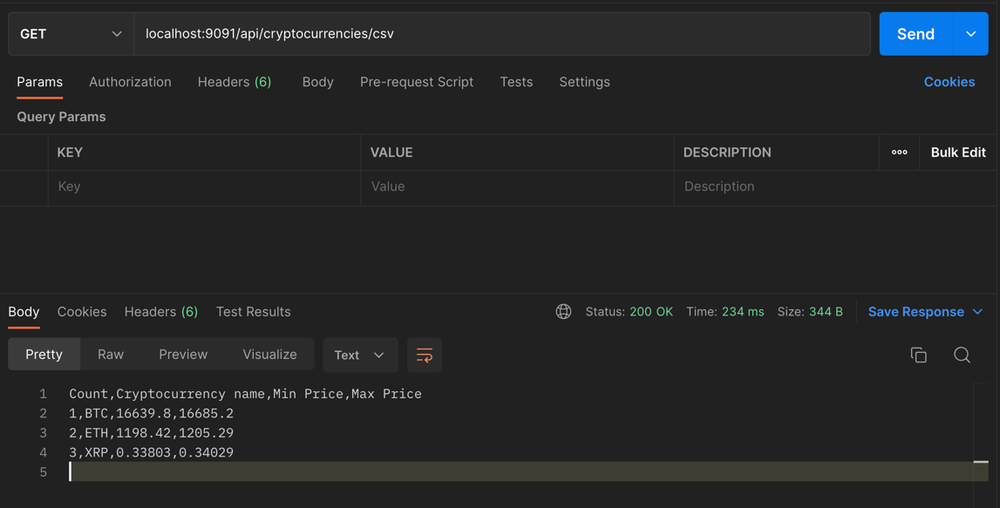
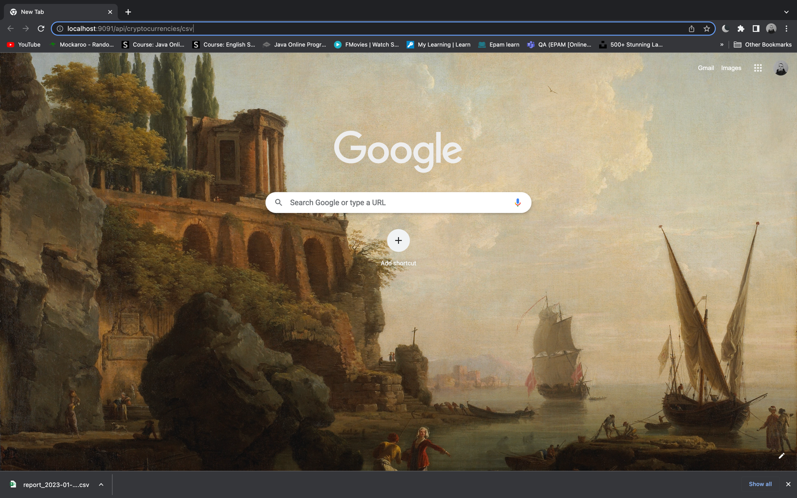
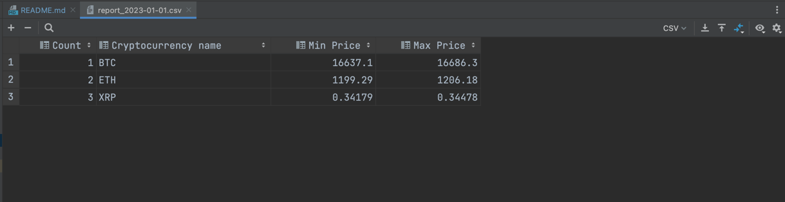
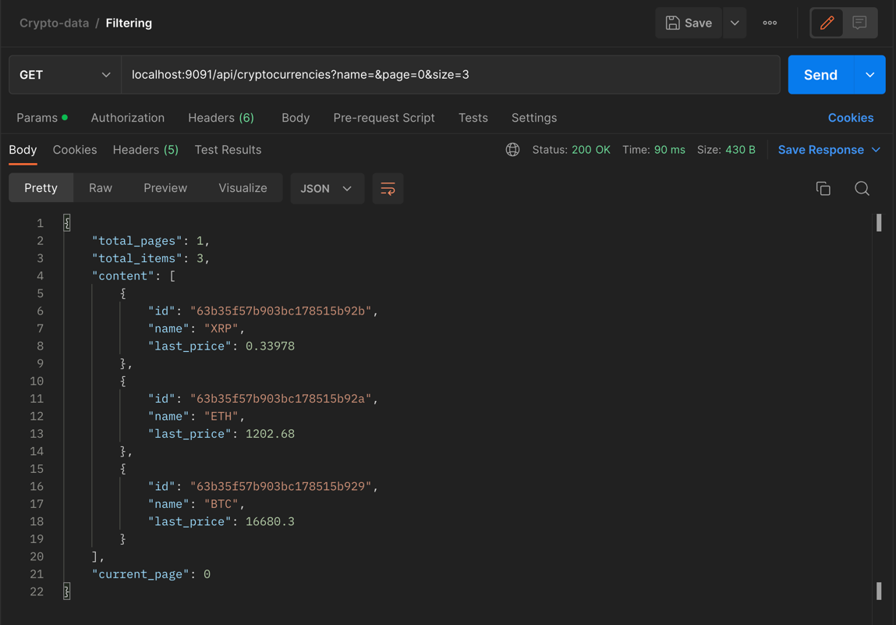

# Crypto-Data

Application is built on Spring and MongoDB

### Installation

Project was built on Java 17.

To get started you need to have Docker installed on 
your machine 
(In order to use docker-compose which is installed MongoDB in the system, but you can avoid using Docker if you have MongoDB already).

```bash
  docker-compose -f docker-mongoDB.yaml up
```

The server runs on 9091 port, but if you have any conflicts, you can change it
```
#application.yml

server:
  port: 9091
```

## Run it 🚀

That's all, you need to run Application class in your IDE.

```java
@SpringBootApplication
public class DataApplication {
    // ...
}
```

The project has a Bootstrap class,
which fetches the currencies and inserts them into the DB. The data updates on each restart.

```java
@Component
public class Bootstrap {
  //...
}
```

### Report  📗

Let's try to receive CSV file from the endpoint. 
This endpoint is downloadable it means that the file will be automatically 
downloaded after requesting the link.

`localhost:9091/api/cryptocurrencies/csv`

Postman:

Following the link in the browser:

Opening the CSV file after downloading int the IDE:



---
Let's try to receive a selected page with selected number of elements

`/api/cryptocurrencies?name=&page=0&size=3`



---
You can get the `max` price of the currency (e.g. BTC)

`/api/cryptocurrencies/maxprice?name=BTC`

```
{
    "id": "63b35f57b903bc178515b929",
    "name": "BTC",
    "content": {
        "highest_price": {
            "time": "2023-01-01T22:45:00",
            "price": 16685.2
        }
    }
}
```

---
Furthermore, you can fetch the `min` price of the currency (e.g. ETH)

`/api/cryptocurrencies/minprice?name=ETH`

```
{
    "id": "63b35f57b903bc178515b92a",
    "name": "ETH",
    "content": {
        "lowest_price": {
            "time": "2023-01-01T19:00:00",
            "price": 1199.12
        }
    }
}
```

All possible exception situations are handled properly and
the project is covered with tests. CSV is already included in `reports` folder.

### Postman 🌿

The collection of requests: [Link](https://api.postman.com/collections/18627038-f32079c1-be57-4358-9e7f-7882b099417d?access_key=PMAT-01GNTC1EEEYMVG48XKBC6FHH16) (api.postman.com)
